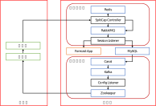

# 简介

项目分为客户端和服务器两个部分。客户端嗅探网络流量，服务器分析前者采集的数据，此外，通过服务器能够控制客户端的配置信息，包括监听的网络设备、BPF 表达式、服务器的地址等等。

**客户端** 包括监听器和嗅探器两个部分，监听器监听 ZK 中的配置信息，当配置信息更新时重启嗅探器；嗅探器嗅探网络流量，然后上传到服务器处进行分析。

**服务器** 包括配置服务器和分析服务器两个部分，配置服务器部分具有无侵入式的特点，使用 Canal 分析 MySQL 中的配置信息，在增、删、改时对 ZK 做出相应的操作，同步 MySQL 和 ZK 中的配置信息；分析服务器部分使用 Redis 记录同一会话的数据包，在记录的会话并不存在或者数量达到一定程度时，分别发送延迟消息和立即消息到 RabbitMQ 中，保证一定对网络流量进行分析，并且尽量具备实时的特性，然后通过 Flask 部署的 PyTorch 模型进行预测，最后将预测结果记录到 MySQL 中。

# 详细说明

## 客户端

监听器部分：

1）监听器连接 ZK 数据库，派生子线程；
2）监听器的主线程获取 ZK 数据库中的配置信息，并且解析，包括嗅探的网络设备，BPF 表达式，以及服务器的地址。派生子进程（嗅探器），等待子进程运行结束。当子进程运行结束时，重复根据配置信息派生子进程；
3）监听器的子线程监听 ZK 数据库中配置信息的更新。当数据更新时，获取、解析配置信息，然后通过信号的方式结束子进程。

注意：（1）主线程只会获取一次 ZK 数据库中的配置信息，相反，子线程则是多次获取；（2）获取配置信息之后，主线程只会重复派生进程、等待后者运行结束的循环，更新的配置信息通过子线程获取；类似，子线程重复监听更新，获取、解析数据，以及停止子进程的操作；（3）由于 Linux 系统的特性，子进程的虚拟内存和信号集合只会复制当前线程的，出于主线程并未监听 ZK 数据库中配置信息的缘故，子进程不会像主进程的子线程一样触发对应的监听操作。

嗅探器部分：

1，派生线程池，其中线程池屏蔽信号，只能主线程触发信号；
2，嗅探器嗅探网络流量，每当采集足够的数据便向线程池派发任务，任务的内容是向指定服务器上传嗅探的网络流量，其中网络流量暂存在本地的临时文件中；
3，当嗅探器触发信号时，依次执行停止嗅探、等待线程池中残留的任务全部运行完成、进程结束的操作。

注意：（1）嗅探的主线程嗅探网络流量，具体执行上传的操作由线程池来执行；（2）临时文件具备在关闭文件描述符和进程结束时自动删除的特性，因此适合作为缓冲。